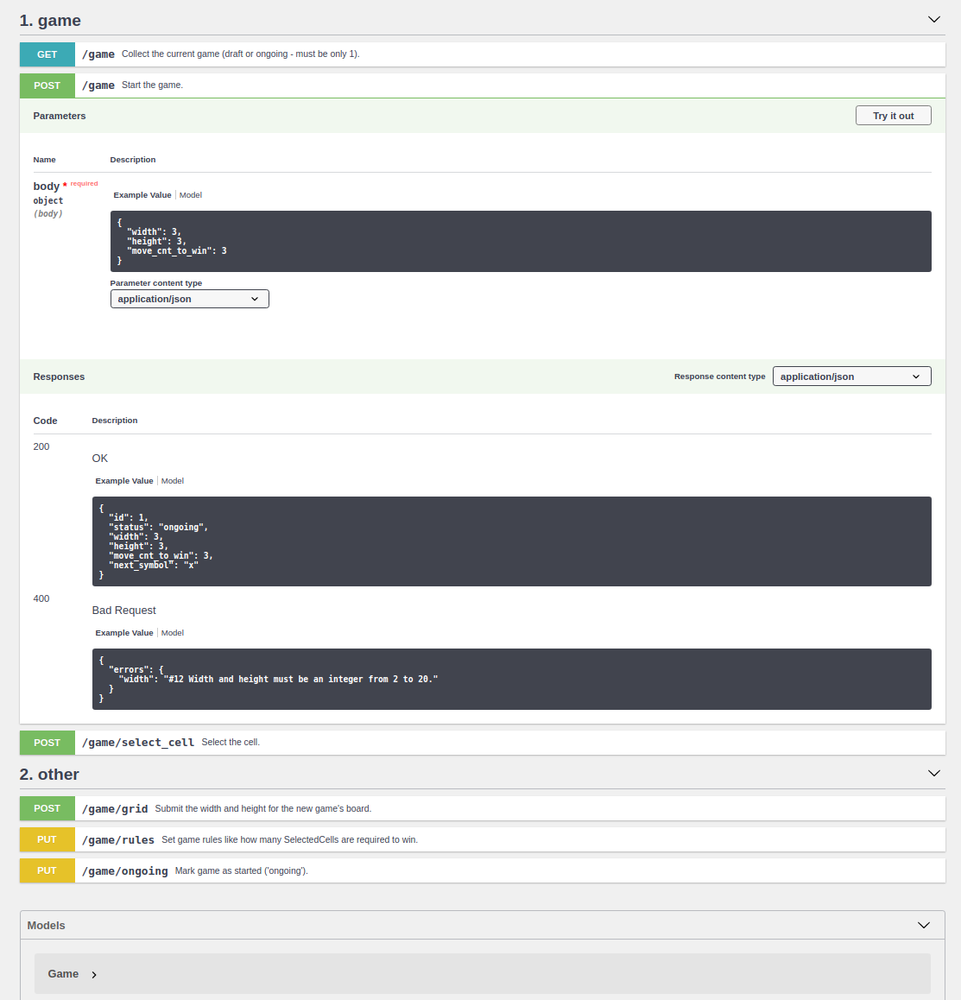

#### Flexi Tic-Tac-Toe

Forget the old 3x3 board. Choose Your own width, height and steps required to win!


## FIRST TIME? HOW TO SET THIS UP?

#### [1. Install docker]((https://github.com/janis-rullis/dev/blob/master/Docker/README.md#install))

Docker is a virtual environment with all the required software included. See [all other benefits](Why-use-docker.md).

#### 2. Provide Your environment values

- Copy the `.env.example` to `.env` and fill `FILL_THIS` values in it.

#### 3. Execute the `setup.sh` script <sup>*</sup>

It will download, install and prepare all the required software.

```shell
./setup.sh
```

#### 4. Add these to Your `hosts` file

This transletes the machines address to the domain-name.

```
172.71.3.10     lm1.local
172.71.3.11     api.lm1.local
172.71.3.14     pma.lm1.local
```

## ALREADY SET-UP?

* `./start.sh` - Start containers once the setup has been done.
* `./connect.sh` - Connect to the main container.
* `./test.sh` - Execute PHPUnit tests.
* `./lint.sh` - Check and format the code.

## Documentation

This describes all the available functions and the way how to call them.

* http://api.lm1.local/doc



## Wiki

* https://github.com/janis-rullis/lm1-symfony5-vue2-api/wiki

## Have questions? Found a bug?

Please, submit an issue https://github.com/janis-rullis/lm1-symfony5-vue2-api/issues
